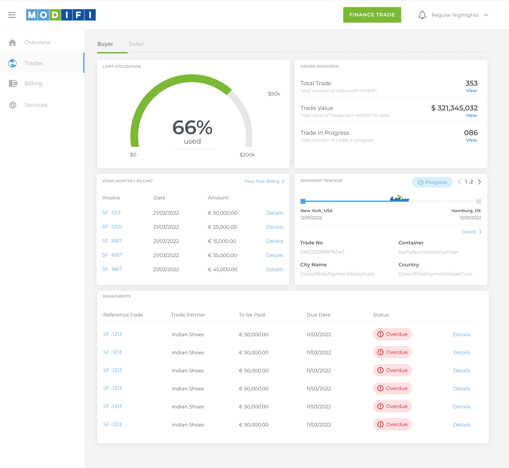
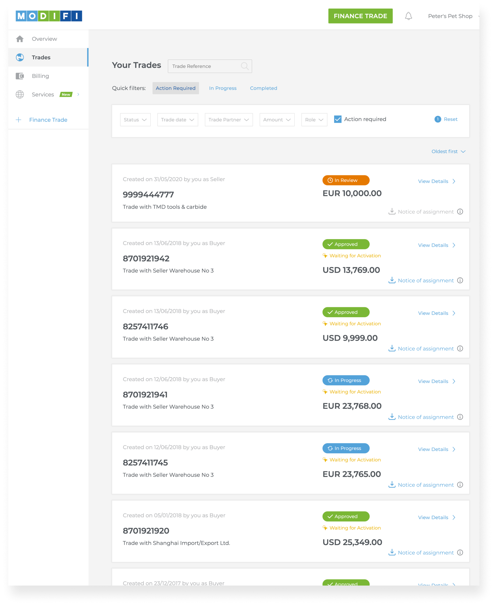
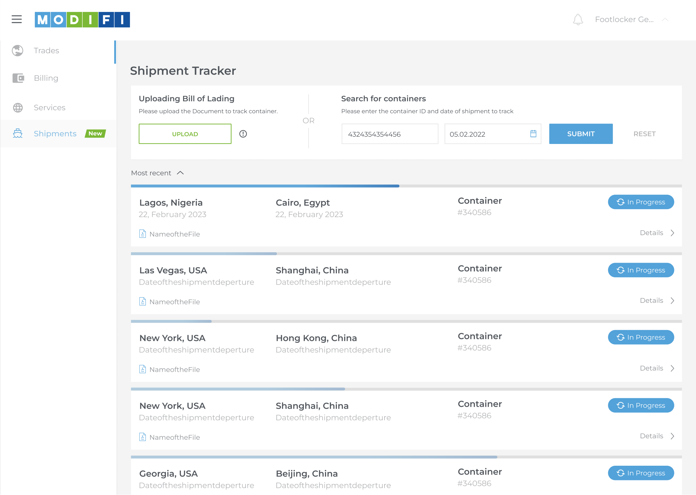
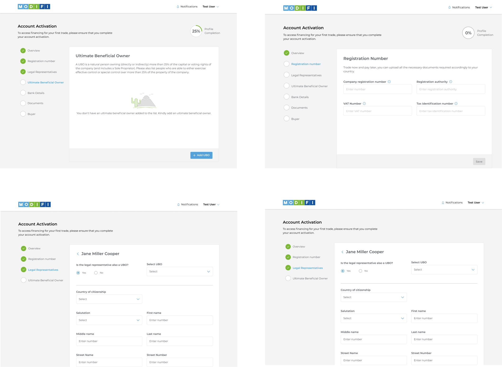
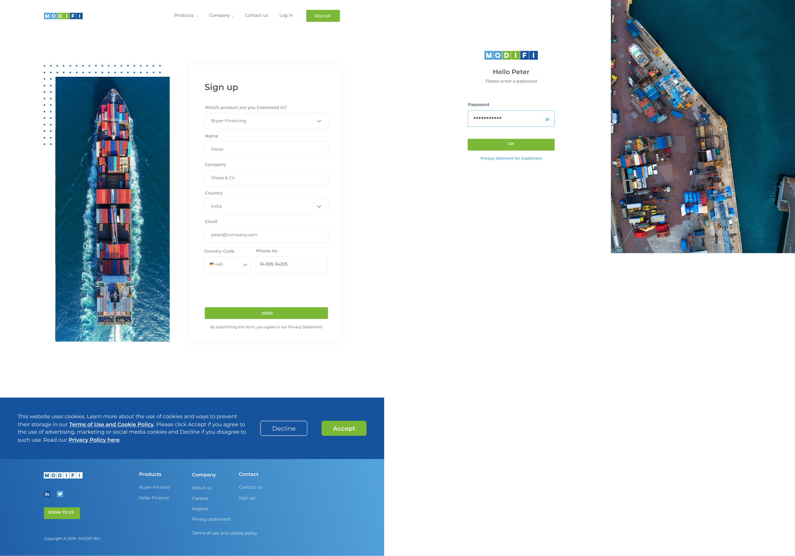

# MODIFI Dashboard

A trade finance dashboard built for MODIFI to help businesses manage trades, track shipments, monitor repayments, and streamline customer onboarding.

## Overview

## Trades

## Shipment Tracker

## Onboarding

## Sign Up

## Features

* Dashboard for monitoring trade finance activity
* Trade management interface
* Shipment tracking workflow
* Customer onboarding experience
* Repayments table with dynamic data rendering
* Responsive layouts and reusable UI components

## Tech Stack

* React
* Next.js
* TypeScript
* SCSS
